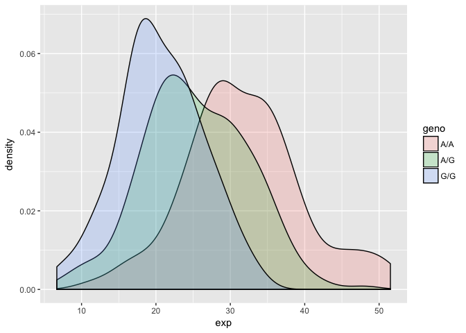
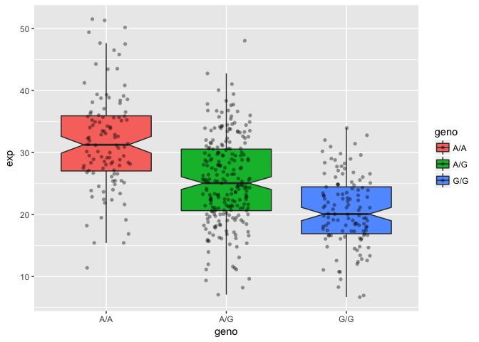

Genome Informatics (Part I)
================

Section 1: Identify Genetic Variants of Interest
================================================

1000 Genomes Data Analysis
--------------------------

Downloaded genotype data from Ensemble for Asthma associated SNP rs8067378 See: (MXL) Mexican Ancestry in Los Angeles, California

``` r
# Read CSV file
genotype <- read.csv("373531-SampleGenotypes-Homo_sapiens_Variation_Sample_rs8067378.csv")

head(genotype)
```

    ##   Sample..Male.Female.Unknown. Genotype..forward.strand. Population.s.
    ## 1                  NA19648 (F)                       A|A ALL, AMR, MXL
    ## 2                  NA19649 (M)                       G|G ALL, AMR, MXL
    ## 3                  NA19651 (F)                       A|A ALL, AMR, MXL
    ## 4                  NA19652 (M)                       G|G ALL, AMR, MXL
    ## 5                  NA19654 (F)                       G|G ALL, AMR, MXL
    ## 6                  NA19655 (M)                       A|G ALL, AMR, MXL
    ##   Father Mother
    ## 1      -      -
    ## 2      -      -
    ## 3      -      -
    ## 4      -      -
    ## 5      -      -
    ## 6      -      -

Find how many of each genotype there are in this dataset.

``` r
genotype.summary <- table(genotype[,2])
```

Proportion of each genotype

``` r
genotype.summary/nrow(genotype) * 100
```

    ## 
    ##     A|A     A|G     G|A     G|G 
    ## 34.3750 32.8125 18.7500 14.0625

**Q5.** What proportion of the Mexican Ancestry in Los Angeles sample population (MXL) are homozygous for the asthma associated SNP (G|G)?

**A5.** 14%

Section 2: Initial RNA-Seq Analysis
===================================

RNA-Seq
-------

Look more closely at sample HG00109 with G|G gentoype for this SNP (from GBR population).

### Side note on Fastq quality scores

``` r
# install.packages("seqinr")
# install.packages("gtools")

library(seqinr)
library(gtools)

phred <- asc( s2c("DDDDCDEDCDDDDBBDDDCC@") ) - 33
phred
```

    ##  D  D  D  D  C  D  E  D  C  D  D  D  D  B  B  D  D  D  C  C  @ 
    ## 35 35 35 35 34 35 36 35 34 35 35 35 35 33 33 35 35 35 34 34 31

Section 3: Mapping RNA-Seq Reads to Genome
==========================================

Section 4: Population Scale Analysis
====================================

RNA-Seq Population Scale Analysis
---------------------------------

Read our results file from RNA-Seq across the ~230 samples (i.e. people)

``` r
expr <- read.table("rs8067378_ENSG00000172057.6.txt")
```

Look at the data.

``` r
table(expr$geno)
```

    ## 
    ## A/A A/G G/G 
    ## 108 233 121

How many samples?

``` r
nrow(expr)
```

    ## [1] 462

Expression level summary stats

``` r
summary(expr)
```

    ##      sample     geno          exp        
    ##  HG00096:  1   A/A:108   Min.   : 6.675  
    ##  HG00097:  1   A/G:233   1st Qu.:20.004  
    ##  HG00099:  1   G/G:121   Median :25.116  
    ##  HG00100:  1             Mean   :25.640  
    ##  HG00101:  1             3rd Qu.:30.779  
    ##  HG00102:  1             Max.   :51.518  
    ##  (Other):456

``` r
summary(expr$exp[(expr$geno == "G/G")])
```

    ##    Min. 1st Qu.  Median    Mean 3rd Qu.    Max. 
    ##   6.675  16.903  20.074  20.594  24.457  33.956

``` r
summary(expr$exp[(expr$geno == "A/A")])
```

    ##    Min. 1st Qu.  Median    Mean 3rd Qu.    Max. 
    ##   11.40   27.02   31.25   31.82   35.92   51.52

``` r
summary(expr$exp[(expr$geno == "A/G")])
```

    ##    Min. 1st Qu.  Median    Mean 3rd Qu.    Max. 
    ##   7.075  20.626  25.065  25.397  30.552  48.034

``` r
# Boxplot
boxplot(exp~geno, data=expr, notch=TRUE)
```


``` r
library(ggplot2)

ggplot(expr,aes(geno, exp)) + geom_boxplot()
```


``` r
ggplot(expr, aes(exp, fill = geno)) + geom_density(alpha = 0.2)
```



``` r
ggplot(expr, aes(geno, exp, fill=geno)) + 
  geom_boxplot(notch=TRUE, outlier.shape = NA) + 
  geom_jitter(shape=16, position=position_jitter(0.2), alpha=0.4)
```


