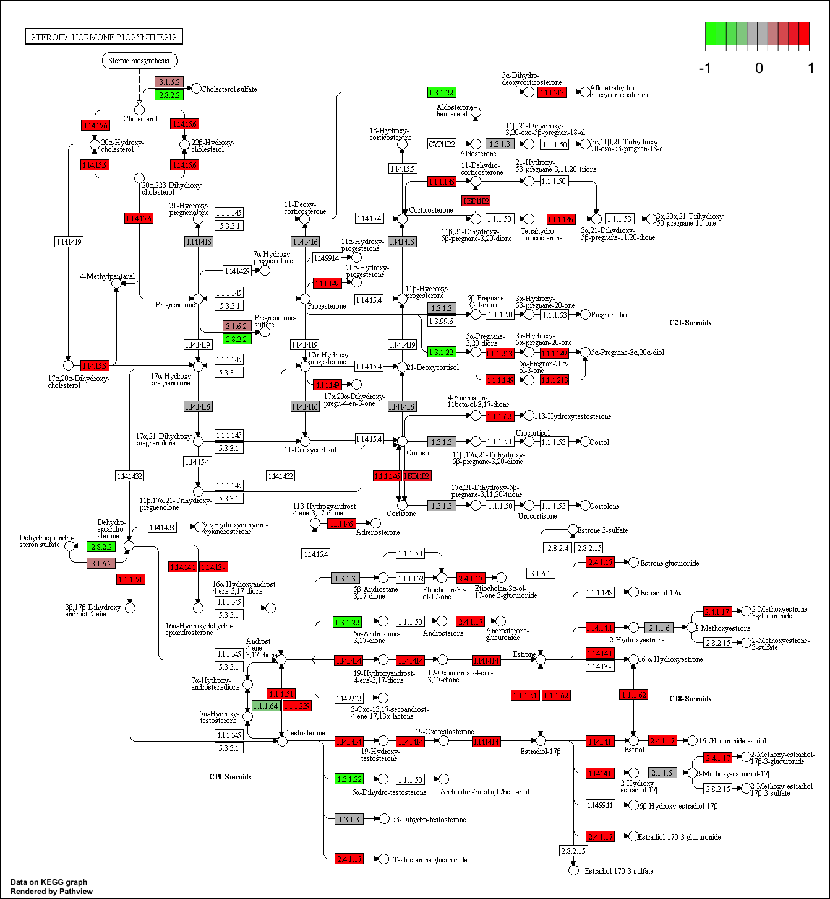
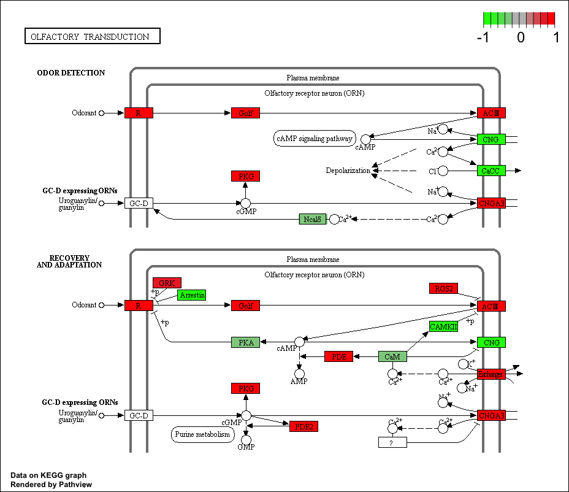

```{r setup, include=FALSE}
knitr::opts_chunk$set(echo = TRUE)
```

# Section 1. Differential Expression Analysis

```{r}
# library(dplyr)
library(DESeq2)
```

```{r}
metaFile <- "L15Data/GSE37704_metadata.csv"

countFile <- "L15data/GSE37704_featurecounts.csv"
```

```{r}
# Import metadata and take a peak
colData <- read.csv(metaFile, row.names=1)
head(colData)
```

```{r}
# Import countdata and take a peak
countData <- read.csv(countFile, row.names=1)
head(countData)
```

Remove that odd first column in countData namely countData$length.
```{r}
# Note we need to remove the odd first $length col
countData <- as.matrix(countData[,-1])
head(countData)
```

Get rid of zero entries, as we have no data for these.
```{r}
# Filter count data where you have 0 read count across all samples.
countData = countData[rowSums(countData)>1, ]
head(countData)
```

Setup the DESeqDataSet object required for the DESeq() function and then run the DESeq pipeline. 
```{r}
dds = DESeqDataSetFromMatrix(countData=countData,
                             colData=colData,
                             design=~condition)
dds = DESeq(dds)
```

```{r}
dds
```

Get results for the HoxA1 knockdown versus control siRNA.

```{r}
res = results(dds, contrast=c("condition", "hoxa1_kd", "control_sirna"))
```

Reorder these results by p-value and call summary() on the results object to get a sense of how many genes are up or down-regulated at the default FDR of 0.1
```{r}
res = res[order(res$pvalue),]
summary(res)
```

```{r}
library("AnnotationDbi")
library("org.Hs.eg.db")
```

```{r}
columns(org.Hs.eg.db)
```

```{r}
res$symbol = mapIds(org.Hs.eg.db,
                    keys=row.names(res), 
                    column="SYMBOL",
                    keytype="ENSEMBL",
                    multiVals="first")
```

```{r}
res$entrez = mapIds(org.Hs.eg.db,
                    keys=row.names(res), 
                    column="ENTREZID",
                    keytype="ENSEMBL",
                    multiVals="first")
```

```{r}
res$name =   mapIds(org.Hs.eg.db,
                    keys=row.names(res), 
                    column="GENENAME",
                    keytype="ENSEMBL",
                    multiVals="first")
```

```{r}
head(res, 10)
```

# Section 2. Pathway Analysis

## KEGG Pathways

```{r}
# source("http://bioconductor.org/biocLite.R")
# biocLite( c("pathview", "gage", "gageData") )
```


```{r}
library(pathview)
```

```{r}
library(gage)
library(gageData)

data(kegg.sets.hs)
data(sigmet.idx.hs)

kegg.sets.hs = kegg.sets.hs[sigmet.idx.hs]
head(kegg.sets.hs, 3)
```

Name values by the Entrez gene IDs.
```{r}
foldchanges = res$log2FoldChange
names(foldchanges) = res$entrez
head(foldchanges)
```

Run the pathway analysis
```{r}
# Get the results
keggres = gage(foldchanges, gsets=kegg.sets.hs, same.dir=TRUE)
```

Look at the result object
```{r}
attributes(keggres)
```

Access a named element.
```{r}
# Greater
head(keggres$greater)
```

```{r}
# Less
head(keggres$less)
```

```{r}
# Stats
head(keggres$stats)
```

Look at both up (greater), down (less), and statistics by calling head() with the lapply() function

```{r}
lapply(keggres, head)
```

Process the results to pull out the top 5 upregulated pathways, then further process that just to get the IDs.
```{r}
## Sanity check displaying all pathways data
pathways = data.frame(id=rownames(keggres$greater), keggres$greater)
head(pathways)
```

Make a pathway plot with our result shown in color. To begin with lets manually supply a pathway.id (namely the first part of the "hsa04110 Cell cycle") that we could see from the print out above
```{r}
pathview(gene.data=foldchanges, pathway.id="hsa04110")
```

Play with the other input arguments to pathview() to change the dispay in various ways including generating a PDF graph. For example: 
```{r}
# A different PDF based output of the same data
pathview(gene.data=foldchanges, pathway.id="hsa04110", kegg.native=FALSE)
```

Here is the default low resolution raster PNG output from the first pathview() call above:


Process our results a bit more to automagicaly pull out the top 5 upregulated pathways, then further process that just to get the IDs needed by the pathview() function
```{r}
## Focus on top 5 upregulated pathways here for demo purposes only
keggrespathways <- rownames(keggres$greater)[1:5]

# Extract the IDs part of each string
keggresids = substr(keggrespathways, start=1, stop=8)
keggresids
```

Pass these IDs in keggresids to the pathview() function to draw plots for all the top 5 pathways.
```{r}
pathview(gene.data=foldchanges, pathway.id=keggresids, species="hsa")
```

Here are the default low resolution raster PNG outputs from the pathview() calls above:







# Section 3. Gene Ontology (GO)

Only do Biological Process.
```{r}
data(go.sets.hs)
data(go.subs.hs)
gobpsets = go.sets.hs[go.subs.hs$BP]

gobpres = gage(foldchanges, gsets=gobpsets, same.dir=TRUE)

lapply(gobpres, head)
```

# Section 4. Reactome Pathway Analysis

Output the list of significant genes at the 0.05 level as a plain text file:
```{r}
sig_genes <- res[res$padj <= 0.05 & !is.na(res$padj), "symbol"]
print(paste("Total number of significant genes:", length(sig_genes)))
```

```{r}
write.table(sig_genes, file="significant_genes.txt", row.names=FALSE, col.names=FALSE, quote=FALSE)
```

# Section 5. GO Analysis
Gene Set Gene Ontology (GO) Enrichment is a method to determine over-represented or under-represented GO terms for a given set of genes. GO terms are formal structured controlled vocabularies (ontologies) for gene products in terms of their biological function. The goal of this analysis is to determine the biological process the given set of genes are associated with.

To perform Gene Set GO Enrichment online go to the website http://www.geneontology.org/page/go-enrichment-analysis. Paste your significant gene list from section 4. Then, select “biological process” and “homo sapiens”, and click submit.

# Session Information
```{r}
sessionInfo()
```

