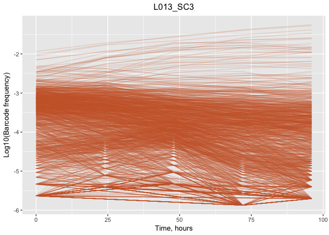
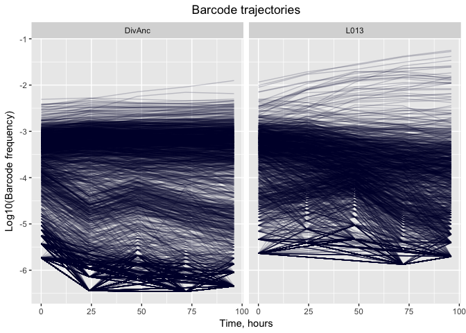

TnSeq Practice with Alena
================

Let's load the libraries we are going to use in this practice section.

``` r
library(tidyr)
library(dplyr)
```

    ## 
    ## Attaching package: 'dplyr'

    ## The following objects are masked from 'package:stats':
    ## 
    ##     filter, lag

    ## The following objects are masked from 'package:base':
    ## 
    ##     intersect, setdiff, setequal, union

``` r
library(ggplot2)
library(readr)
```

Let's load the file with experimental results from TnSeq experiment.

``` r
#Note: tbl_df function forwards the argument to "as_data_frame""

exp_data<-read.csv("Experimental_results.csv")
head(exp_data)
```

    ##   X BC_ID       H_0      H_24      H_48      H_72      H_96 Mut_ID Strain
    ## 1 1     1 -5.430079 -6.142158        NA -6.159939        NA    185 DivAnc
    ## 2 2    10 -5.731109        NA        NA        NA        NA    655 DivAnc
    ## 3 3    16 -5.731109 -6.443188        NA -6.460969        NA    648 DivAnc
    ## 4 4    18        NA -6.443188        NA        NA        NA    109 DivAnc
    ## 5 5    23        NA        NA -6.159156        NA        NA    421 DivAnc
    ## 6 6    30 -3.762626 -3.634977 -3.862490 -4.093613 -4.425554   1012 DivAnc
    ##   Environment
    ## 1      SC_3.0
    ## 2      SC_3.0
    ## 3      SC_3.0
    ## 4      SC_3.0
    ## 5      SC_3.0
    ## 6      SC_3.0

Lets modify a table:

First, remove the column “X”. We are not going to use the information contained in it. For this we are going to use function “select”

``` r
# Remove column "X" from a dataframe:
exp_data<-select(exp_data, -X)
head(exp_data)
```

    ##   BC_ID       H_0      H_24      H_48      H_72      H_96 Mut_ID Strain
    ## 1     1 -5.430079 -6.142158        NA -6.159939        NA    185 DivAnc
    ## 2    10 -5.731109        NA        NA        NA        NA    655 DivAnc
    ## 3    16 -5.731109 -6.443188        NA -6.460969        NA    648 DivAnc
    ## 4    18        NA -6.443188        NA        NA        NA    109 DivAnc
    ## 5    23        NA        NA -6.159156        NA        NA    421 DivAnc
    ## 6    30 -3.762626 -3.634977 -3.862490 -4.093613 -4.425554   1012 DivAnc
    ##   Environment
    ## 1      SC_3.0
    ## 2      SC_3.0
    ## 3      SC_3.0
    ## 4      SC_3.0
    ## 5      SC_3.0
    ## 6      SC_3.0

Let's practice using select() function:

``` r
# Practice selecting certain columns from within a dataset
practice_data <- select(exp_data, Mut_ID, Strain, Environment)
head(practice_data)
```

    ##   Mut_ID Strain Environment
    ## 1    185 DivAnc      SC_3.0
    ## 2    655 DivAnc      SC_3.0
    ## 3    648 DivAnc      SC_3.0
    ## 4    109 DivAnc      SC_3.0
    ## 5    421 DivAnc      SC_3.0
    ## 6   1012 DivAnc      SC_3.0

Lets get ready for plotting:

We are going to use ggplot2 package. Please check the syntax that is commonly used for plotting with this package. Does everything make sense?

``` r
# Information from a ggplot description page:
# ggplot(df, aes(x, y, <other aesthetics>))
```

To make a graph, we need to give the function 2 variables (2 columns) in order to plot them against each other.

What variables are we going to use?

Lets rearrange our table to be able to plot the data easily. Instead on keeping information about barcode frequency in rows, we are going to create a column “Time” with time points and a column “Frequency” with corresponding barcode frequencies.

``` r
# First, check how function "gather" works
exp_rearranged<-gather(exp_data, Generation, Frequency, H_0:H_96)
head(exp_rearranged)
```

    ##   BC_ID Mut_ID Strain Environment Generation Frequency
    ## 1     1    185 DivAnc      SC_3.0        H_0 -5.430079
    ## 2    10    655 DivAnc      SC_3.0        H_0 -5.731109
    ## 3    16    648 DivAnc      SC_3.0        H_0 -5.731109
    ## 4    18    109 DivAnc      SC_3.0        H_0        NA
    ## 5    23    421 DivAnc      SC_3.0        H_0        NA
    ## 6    30   1012 DivAnc      SC_3.0        H_0 -3.762626

You might have noticed that “Generation” column contains both “H” that stands for “hours” and numbers. Lets remove “H\_” part from this column.

Check the syntax of “separate” function.

``` r
# Separate values in "Generation" column into 2 columns
table_for_graph<-separate(exp_rearranged,Generation,into=c("H","Time"))
head(table_for_graph)
```

    ##   BC_ID Mut_ID Strain Environment H Time Frequency
    ## 1     1    185 DivAnc      SC_3.0 H    0 -5.430079
    ## 2    10    655 DivAnc      SC_3.0 H    0 -5.731109
    ## 3    16    648 DivAnc      SC_3.0 H    0 -5.731109
    ## 4    18    109 DivAnc      SC_3.0 H    0        NA
    ## 5    23    421 DivAnc      SC_3.0 H    0        NA
    ## 6    30   1012 DivAnc      SC_3.0 H    0 -3.762626

``` r
# Remove column "H" using function "select"
table_for_graph<-select(table_for_graph, -H)
head(table_for_graph)
```

    ##   BC_ID Mut_ID Strain Environment Time Frequency
    ## 1     1    185 DivAnc      SC_3.0    0 -5.430079
    ## 2    10    655 DivAnc      SC_3.0    0 -5.731109
    ## 3    16    648 DivAnc      SC_3.0    0 -5.731109
    ## 4    18    109 DivAnc      SC_3.0    0        NA
    ## 5    23    421 DivAnc      SC_3.0    0        NA
    ## 6    30   1012 DivAnc      SC_3.0    0 -3.762626

You might have noticed that our table contains a lot of “NA” values. Go ahead and remove them with na.omit function. Don’t forget to check it’s syntax first!

``` r
table_cleaned<-na.omit(table_for_graph)
table_cleaned$Time<-as.numeric(table_cleaned$Time)
head(table_cleaned)
```

    ##   BC_ID Mut_ID Strain Environment Time Frequency
    ## 1     1    185 DivAnc      SC_3.0    0 -5.430079
    ## 2    10    655 DivAnc      SC_3.0    0 -5.731109
    ## 3    16    648 DivAnc      SC_3.0    0 -5.731109
    ## 6    30   1012 DivAnc      SC_3.0    0 -3.762626
    ## 7    38    333 DivAnc      SC_3.0    0 -5.430079
    ## 8    45     71 DivAnc      SC_3.0    0 -3.143398

Now the table is ready. How are we going to plot all the values? Do we need to separate them in any way? If yes, then how?

``` r
# We might need to plot data for each strain separately..
DivAnc<-filter(table_cleaned, table_cleaned$Strain=="DivAnc")
L013<-filter(table_cleaned, table_cleaned$Strain=="L013")
```

``` r
# Make a plot for DivAnc strain
DivAnc_plot=ggplot(DivAnc)+geom_line(aes(x=Time,y=Frequency,group=BC_ID),alpha=.2,colour="#000033")+ggtitle("DivAnc_SC3")+theme(plot.title = element_text(hjust = 0.5))+xlab("Time, hours") + ylab("Log10(Barcode frequency)")
DivAnc_plot
```


``` r
# Make a plot for L013 strain
L013_plot=ggplot(L013)+geom_line(aes(x=Time,y=Frequency,group=BC_ID),alpha=.2,colour="#CC6633")+ggtitle("L013_SC3")+theme(plot.title = element_text(hjust = 0.5))+xlab("Time, hours") + ylab("Log10(Barcode frequency)")
L013_plot
```



Can we make 2 graphs at the same time?

``` r
ggplot(table_cleaned)+geom_line(aes(x=Time,y=Frequency,group=BC_ID),alpha=.2,colour="#000033")+facet_grid(.~Strain)+ggtitle("Barcode trajectories")+theme(plot.title = element_text(hjust = 0.5))+xlab("Time, hours") + ylab("Log10(Barcode frequency)")
```



Let's pick one mutation and check how it behaves in different strains

``` r
# I've chosen Mut_ID==34
mut34<-filter(table_cleaned, table_cleaned$Mut_ID=="34")
head(mut34)     
```

    ##   BC_ID Mut_ID Strain Environment Time Frequency
    ## 1  2034     34 DivAnc      SC_3.0    0 -4.886011
    ## 2  3833     34 DivAnc      SC_3.0    0 -3.662923
    ## 3  4886     34 DivAnc      SC_3.0    0 -3.384756
    ## 4  7291     34 DivAnc      SC_3.0    0 -3.080802
    ## 5 14408     34 DivAnc      SC_3.0    0 -5.731109
    ## 6 17665     34 DivAnc      SC_3.0    0 -5.731109

``` r
ggplot(mut34,aes(Time, Frequency, group=BC_ID, color=BC_ID))+geom_line()+theme(legend.position="none")+facet_grid(.~Strain)+ggtitle("Mutation_34")+xlab("Time, hours") + ylab("Log10(Barcode frequency)")+theme(plot.title = element_text(hjust = 0.5))
```


Plot? Why do we have 2 clusters of barcodes?

Lets filter out barcodes with frequency &gt; (-5) and use them for subsequent analysis.

``` r
mut34_f<-filter(mut34, mut34$Frequency>(-5))
head(mut34_f)
```

    ##   BC_ID Mut_ID Strain Environment Time Frequency
    ## 1  2034     34 DivAnc      SC_3.0    0 -4.886011
    ## 2  3833     34 DivAnc      SC_3.0    0 -3.662923
    ## 3  4886     34 DivAnc      SC_3.0    0 -3.384756
    ## 4  7291     34 DivAnc      SC_3.0    0 -3.080802
    ## 5 21930     34 DivAnc      SC_3.0    0 -3.271717
    ## 6 25361     34 DivAnc      SC_3.0    0 -2.966933

Plot again the same type of graph, but use filtered data. Make sure that you have done everything right.

``` r
ggplot(mut34_f,aes(Time, Frequency, group=BC_ID, color=BC_ID))+geom_line()+theme(legend.position="none")+facet_grid(.~Strain)+ggtitle("Mutation_34")+xlab("Time, hours") + ylab("Log10(Barcode frequency)")+theme(plot.title = element_text(hjust = 0.5))
```


Plot the best fit lines.

``` r
ggplot(mut34_f,aes(Time, Frequency, colour = BC_ID, group=BC_ID))+geom_point()+geom_smooth(se = FALSE, method = "lm")+facet_grid(.~Strain)+theme(legend.position="none")+ggtitle(paste("Mutation",34, sep="_"))+xlab("Time, hours")+ ylab("Log10(Barcode frequency)")
```


Now you can choose a different mutation and check how it behaves across strains.

Now it’s time to estimate slope for each barcode. Lets greate a file that will contain information about BC\_ID, Mut\_ID, Strain, and estimated slope.

``` r
# Lets become familiar with lm function:

# For this exercise, take the filtered data for mutation 34 (mut34_f) and filter out information about one barcode you like

# I have chosen BC_ID=25361 in DivAnc strain
BC_25361<-filter(mut34_f, mut34_f$BC_ID=="25361", mut34_f$Strain=="DivAnc")
BC_25361
```

    ##   BC_ID Mut_ID Strain Environment Time Frequency
    ## 1 25361     34 DivAnc      SC_3.0    0 -2.966933
    ## 2 25361     34 DivAnc      SC_3.0   24 -2.810832
    ## 3 25361     34 DivAnc      SC_3.0   48 -2.782579
    ## 4 25361     34 DivAnc      SC_3.0   72 -2.730833
    ## 5 25361     34 DivAnc      SC_3.0   96 -2.760867

``` r
#Lets plot frequency of this barcode:
BC_plot <- ggplot(BC_25361,aes(Time, Frequency, colour = BC_ID))+geom_point()+theme(legend.position="none")+ggtitle("BC_25361")+xlab("Time, hours") + ylab("Log10(Frequency)")
BC_plot
```


``` r
#Lets use lm function to fit the line to these points:
ggplot(BC_25361,aes(Time, Frequency, colour = BC_ID))+geom_point()+geom_smooth(se = FALSE, method = "lm")+theme(legend.position="none")+ggtitle("BC_25361")+xlab("Time, hours") + ylab("Log10(Frequency)")
```


OR,

``` r
BC_plot_lm <- BC_plot+geom_smooth(se = FALSE, method = "lm")
BC_plot_lm
```


``` r
# Lets check what data does lm function return:
regression_model<-lm(Frequency~Time,BC_25361)
summary_data<-summary(regression_model)
summary_data
```

    ## 
    ## Call:
    ## lm(formula = Frequency ~ Time, data = BC_25361)
    ## 
    ## Residuals:
    ##        1        2        3        4        5 
    ## -0.05810  0.04879  0.02783  0.03036 -0.04888 
    ## 
    ## Coefficients:
    ##               Estimate Std. Error t value Pr(>|t|)    
    ## (Intercept) -2.9088351  0.0443664 -65.564 7.82e-06 ***
    ## Time         0.0020506  0.0007547   2.717   0.0727 .  
    ## ---
    ## Signif. codes:  0 '***' 0.001 '**' 0.01 '*' 0.05 '.' 0.1 ' ' 1
    ## 
    ## Residual standard error: 0.05728 on 3 degrees of freedom
    ## Multiple R-squared:  0.7111, Adjusted R-squared:  0.6147 
    ## F-statistic: 7.383 on 1 and 3 DF,  p-value: 0.07273

``` r
# The information we are interested in is the value of Slope and Intercept of this line:
# Let's try to access them:

# Time
Time<-summary_data$coefficients[2]
Time
```

    ## [1] 0.002050551

``` r
# Intercept:
Intercept<-summary_data$coefficients[1]
Intercept
```

    ## [1] -2.908835

Now we can find slopes for each barcode for each mutation in all strains.

``` r
# Lets create the file:
data_header=matrix(data = NA,nrow = 1,ncol = 7)
        data_header[1]="Mut_ID"
        data_header[2]="BC_ID"
        data_header[3]="Strain"
        data_header[4]="Slope"
        data_header[5]="Intercept"
        data_header[6]="R^2"
write.table(data_header,"~/Documents/UCSD/Year 4/Year 4 - Spring/BIMM 143/R/bimm_143_github/Lecture16/Tnseq_practice_output.csv",append = FALSE, sep = ",",eol="\n",dec=".",row.names = FALSE,col.names = FALSE)
```

``` r
for (mut in unique(table_cleaned$Mut_ID)) {
    mut_data=filter(table_cleaned,table_cleaned$Mut_ID==paste(mut))
    #now we have all data for each mutation separately
    for (bc in unique (mut_data$BC_ID)) {
      #now we filtered data for each barcode within 1 mutation
      bc_mut_data=filter(mut_data,mut_data$BC_ID==paste(bc))
      for (strain in unique (bc_mut_data$Strain)) {
        str_bc_mut_data=filter(bc_mut_data,bc_mut_data$Strain==paste(strain))
        #only considering combinations with 3 or more data points - anything less is statistically insignificant
        if (nrow(str_bc_mut_data)>2){
          regression_model=lm(Frequency~Time,str_bc_mut_data)
          summary_data=summary(regression_model)
          #now write to the output file! Prepare the data array first
          data_output=matrix(data = NA,nrow = 1,ncol = 6)
          data_output[1]=mut
          data_output[2]=bc
          data_output[3]=strain
          #slope
          data_output[4]=summary_data$coefficients[2]
          #intercept
          data_output[5]=summary_data$coefficients[1]
          #r-squared
          data_output[6]=summary_data$r.squared
          #time to write
          write.table(data_output,"~/Documents/UCSD/Year 4/Year 4 - Spring/BIMM 143/R/bimm_143_github/Lecture16/Tnseq_practice_output.csv",append = TRUE, sep = ",",eol="\n",dec=".",row.names = FALSE,col.names = FALSE)
      }
    }
  }
 }
```
