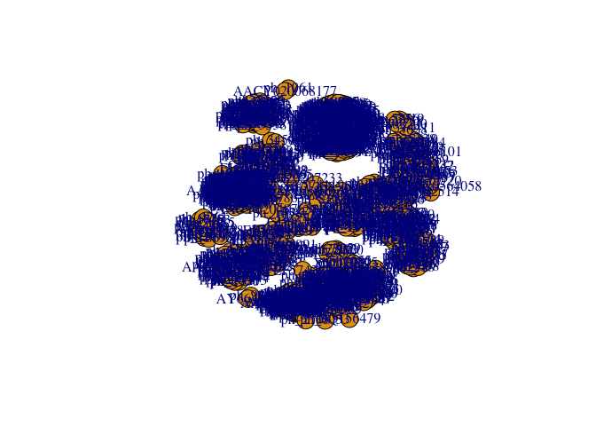
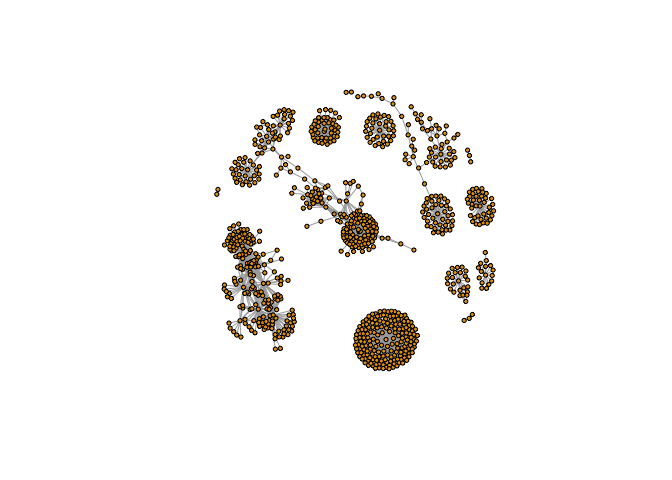

Metagenomics Co-Occurrence Networks
================

Section 1. Set up Cytoscape and the iGraph R Package
====================================================

Install and Download Required R Packages
----------------------------------------

Install required R packages. (Lines have been commented in order to avoid installation during every run.)

``` r
# CRAN packages
## install.packages( c("igraph", "RColorBrewer") )

# Bioconductor package
## source("https://bioconductor.org/biocLite.R")
## biocLite("RCy3")
```

Load R packages.

``` r
library(RCy3)
```

    ## Loading required package: graph

    ## Loading required package: BiocGenerics

    ## Loading required package: parallel

    ## 
    ## Attaching package: 'BiocGenerics'

    ## The following objects are masked from 'package:parallel':
    ## 
    ##     clusterApply, clusterApplyLB, clusterCall, clusterEvalQ,
    ##     clusterExport, clusterMap, parApply, parCapply, parLapply,
    ##     parLapplyLB, parRapply, parSapply, parSapplyLB

    ## The following objects are masked from 'package:stats':
    ## 
    ##     IQR, mad, sd, var, xtabs

    ## The following objects are masked from 'package:base':
    ## 
    ##     anyDuplicated, append, as.data.frame, cbind, colMeans,
    ##     colnames, colSums, do.call, duplicated, eval, evalq, Filter,
    ##     Find, get, grep, grepl, intersect, is.unsorted, lapply,
    ##     lengths, Map, mapply, match, mget, order, paste, pmax,
    ##     pmax.int, pmin, pmin.int, Position, rank, rbind, Reduce,
    ##     rowMeans, rownames, rowSums, sapply, setdiff, sort, table,
    ##     tapply, union, unique, unsplit, which, which.max, which.min

``` r
library(igraph)
```

    ## 
    ## Attaching package: 'igraph'

    ## The following objects are masked from 'package:graph':
    ## 
    ##     degree, edges, intersection, union

    ## The following objects are masked from 'package:BiocGenerics':
    ## 
    ##     normalize, union

    ## The following objects are masked from 'package:stats':
    ## 
    ##     decompose, spectrum

    ## The following object is masked from 'package:base':
    ## 
    ##     union

``` r
library(RColorBrewer)
```

Make Sure Cytoscape is Up and Running
-------------------------------------

Make sure to install and launch Cytoscape!

First Contact
-------------

These functions are a convenient way to verify a connection to Cytoscape and for logging the versions of CyREST and Cytoscape in your scripts.

``` r
library(RCy3)
cwd <- demoSimpleGraph()
```

    ## [1] "type"
    ## [1] "lfc"
    ## [1] "label"
    ## [1] "count"
    ## [1] "edgeType"
    ## [1] "score"
    ## [1] "misc"
    ## Successfully set rule.
    ## Successfully set rule.
    ## Locked node dimensions successfully even if the check box is not ticked.
    ## Locked node dimensions successfully even if the check box is not ticked.
    ## Successfully set rule.
    ## Successfully set rule.

``` r
layoutNetwork(cwd, 'force-directed')

# Choose any of the other possible layouts e.g.:
possible.layout.names <- getLayoutNames(cwd)
layoutNetwork (cwd, possible.layout.names[1])

# Test the connection to Cytoscape.
ping(cwd)
```

    ## [1] "It works!"

Switch Styles
-------------

Check out the marquee style!

``` r
setVisualStyle(cwd, "Marquee")
```

    ## network visual style has been set to "Marquee"

Find out what other styles are available and try a couple:

``` r
styles <- getVisualStyleNames(cwd)
styles
```

    ##  [1] "Curved"               "Gradient1"            "size_rank"           
    ##  [4] "Sample3"              "Sample2"              "default"             
    ##  [7] "Big Labels"           "BioPAX_SIF"           "Sample1"             
    ## [10] "Nested Network Style" "Directed"             "Marquee"             
    ## [13] "default black"        "Solid"                "Minimal"             
    ## [16] "BioPAX"               "Ripple"               "Universe"

``` r
setVisualStyle(cwd, "Ripple")
```

    ## network visual style has been set to "Ripple"

``` r
setVisualStyle(cwd, "Universe")
```

    ## network visual style has been set to "Universe"

Save the image generated in Cytoscape into R.

``` r
saveImage(cwd,
          file.name = "demo",
          image.type = "png",
          h = 350)
```

Section 2. Read Our Metagenomics Data
=====================================

Read in a species co-occurrence matrix that was calculated using Spearman Rank coefficient. (See reference Lima-Mendez et al. (2015) for details).

``` r
# Scripts for processing located in "inst/data-raw/"
prok_vir_cor <- read.delim("./data/virus_prok_cor_abundant.tsv", stringsAsFactors = FALSE)

# Have a peak at the first 6 rows
head(prok_vir_cor)
```

    ##       Var1          Var2    weight
    ## 1  ph_1061 AACY020068177 0.8555342
    ## 2  ph_1258 AACY020207233 0.8055750
    ## 3  ph_3164 AACY020207233 0.8122517
    ## 4  ph_1033 AACY020255495 0.8487498
    ## 5 ph_10996 AACY020255495 0.8734617
    ## 6 ph_11038 AACY020255495 0.8740782

Use the igraph package to convert the co-occurrence dataframe into a network that we can send to Cytoscape. In this case our graph is undirected (so we will set directed = FALSE) since we do not have any information about the direction of the interactions from this type of data.

``` r
g <- graph.data.frame(prok_vir_cor, directed = FALSE)
```

Check the class of our new object g and see that it is of class iGraph.

``` r
class(g)
```

    ## [1] "igraph"

``` r
g
```

    ## IGRAPH b932a57 UNW- 845 1544 -- 
    ## + attr: name (v/c), weight (e/n)
    ## + edges from b932a57 (vertex names):
    ##  [1] ph_1061 --AACY020068177 ph_1258 --AACY020207233
    ##  [3] ph_3164 --AACY020207233 ph_1033 --AACY020255495
    ##  [5] ph_10996--AACY020255495 ph_11038--AACY020255495
    ##  [7] ph_11040--AACY020255495 ph_11048--AACY020255495
    ##  [9] ph_11096--AACY020255495 ph_1113 --AACY020255495
    ## [11] ph_1208 --AACY020255495 ph_13207--AACY020255495
    ## [13] ph_1346 --AACY020255495 ph_14679--AACY020255495
    ## [15] ph_1572 --AACY020255495 ph_16045--AACY020255495
    ## + ... omitted several edges

Our current graph is a little too dense in terms of node labels etc. to have a useful ‘default’ plot figure. But we can have a look anyway.

``` r
plot(g)
```



Turn down our vertex size from the default value of 15 and turn of our vertex labels.

``` r
plot(g, vertex.size=3, vertex.label=NA)
```



Note that we can query (and set) vertex and edge attributes with the V() and E() functions respectively:

``` r
V(g)
```

    ## + 845/845 vertices, named, from b932a57:
    ##   [1] ph_1061       ph_1258       ph_3164       ph_1033       ph_10996     
    ##   [6] ph_11038      ph_11040      ph_11048      ph_11096      ph_1113      
    ##  [11] ph_1208       ph_13207      ph_1346       ph_14679      ph_1572      
    ##  [16] ph_16045      ph_1909       ph_1918       ph_19894      ph_2117      
    ##  [21] ph_2231       ph_2363       ph_276        ph_2775       ph_2798      
    ##  [26] ph_3217       ph_3336       ph_3493       ph_3541       ph_3892      
    ##  [31] ph_4194       ph_4602       ph_4678       ph_484        ph_4993      
    ##  [36] ph_4999       ph_5001       ph_5010       ph_5286       ph_5287      
    ##  [41] ph_5302       ph_5321       ph_5643       ph_6441       ph_654       
    ##  [46] ph_6954       ph_7389       ph_7920       ph_8039       ph_8695      
    ## + ... omitted several vertices

``` r
E(g)
```

    ## + 1544/1544 edges from b932a57 (vertex names):
    ##  [1] ph_1061 --AACY020068177 ph_1258 --AACY020207233
    ##  [3] ph_3164 --AACY020207233 ph_1033 --AACY020255495
    ##  [5] ph_10996--AACY020255495 ph_11038--AACY020255495
    ##  [7] ph_11040--AACY020255495 ph_11048--AACY020255495
    ##  [9] ph_11096--AACY020255495 ph_1113 --AACY020255495
    ## [11] ph_1208 --AACY020255495 ph_13207--AACY020255495
    ## [13] ph_1346 --AACY020255495 ph_14679--AACY020255495
    ## [15] ph_1572 --AACY020255495 ph_16045--AACY020255495
    ## [17] ph_1909 --AACY020255495 ph_1918 --AACY020255495
    ## [19] ph_19894--AACY020255495 ph_2117 --AACY020255495
    ## + ... omitted several edges

Section 3. Read in Taxonomic Classification
===========================================

``` r
# Phage
phage_id_affiliation <- read.delim("./data/phage_ids_with_affiliation.tsv")
head(phage_id_affiliation)
```

    ##   first_sheet.Phage_id first_sheet.Phage_id_network phage_affiliation
    ## 1        109DCM_115804                       ph_775              <NA>
    ## 2        109DCM_115804                       ph_775              <NA>
    ## 3        109DCM_115804                       ph_775              <NA>
    ## 4        109DCM_115804                       ph_775              <NA>
    ## 5        109DCM_115804                       ph_775              <NA>
    ## 6        109DCM_115804                       ph_775              <NA>
    ##   Domain DNA_or_RNA Tax_order Tax_subfamily Tax_family Tax_genus
    ## 1   <NA>       <NA>      <NA>          <NA>       <NA>      <NA>
    ## 2   <NA>       <NA>      <NA>          <NA>       <NA>      <NA>
    ## 3   <NA>       <NA>      <NA>          <NA>       <NA>      <NA>
    ## 4   <NA>       <NA>      <NA>          <NA>       <NA>      <NA>
    ## 5   <NA>       <NA>      <NA>          <NA>       <NA>      <NA>
    ## 6   <NA>       <NA>      <NA>          <NA>       <NA>      <NA>
    ##   Tax_species
    ## 1        <NA>
    ## 2        <NA>
    ## 3        <NA>
    ## 4        <NA>
    ## 5        <NA>
    ## 6        <NA>

``` r
# Bacteria
bac_id_affi <- read.delim("./data/prok_tax_from_silva.tsv")
head(bac_id_affi)
```

    ##    Accession_ID  Kingdom         Phylum          Class             Order
    ## 1 AACY020068177 Bacteria    Chloroflexi   SAR202 clade marine metagenome
    ## 2 AACY020125842  Archaea  Euryarchaeota Thermoplasmata Thermoplasmatales
    ## 3 AACY020187844  Archaea  Euryarchaeota Thermoplasmata Thermoplasmatales
    ## 4 AACY020105546 Bacteria Actinobacteria Actinobacteria             PeM15
    ## 5 AACY020281370  Archaea  Euryarchaeota Thermoplasmata Thermoplasmatales
    ## 6 AACY020147130  Archaea  Euryarchaeota Thermoplasmata Thermoplasmatales
    ##              Family             Genus Species
    ## 1              <NA>              <NA>    <NA>
    ## 2   Marine Group II marine metagenome    <NA>
    ## 3   Marine Group II marine metagenome    <NA>
    ## 4 marine metagenome              <NA>    <NA>
    ## 5   Marine Group II marine metagenome    <NA>
    ## 6   Marine Group II marine metagenome    <NA>

Section 4. Add the Taxonomic Classifications to the Network and Then Send Network to Cytoscape
==============================================================================================

Add in the taxonomic data since some of the organisms do not have taxonomic classifications associated with them. We have described them as “not\_class” for not classified.

``` r
## Create our gene network 'genenet' for cytoscape
genenet.nodes <- as.data.frame(vertex.attributes(g))

## Not all have classification, so create empty columns
genenet.nodes$phage_aff <- rep("not_class", nrow(genenet.nodes))
genenet.nodes$Tax_order <- rep("not_class", nrow(genenet.nodes))
genenet.nodes$Tax_subfamily <- rep("not_class", nrow(genenet.nodes))

for (row in seq_along(1:nrow(genenet.nodes))){
  if (genenet.nodes$name[row] %in% phage_id_affiliation$first_sheet.Phage_id_network){
    id_name <- as.character(genenet.nodes$name[row])
    aff_to_add <- unique(subset(phage_id_affiliation,
                                first_sheet.Phage_id_network == id_name,
                                select = c(phage_affiliation,
                                           Tax_order,
                                           Tax_subfamily)))
    genenet.nodes$phage_aff[row] <- as.character(aff_to_add$phage_affiliation)
    genenet.nodes$Tax_order[row] <- as.character(aff_to_add$Tax_order)
    genenet.nodes$Tax_subfamily[row] <- as.character(aff_to_add$Tax_subfamily)
  }
}
```

``` r
## Do the same for proks
genenet.nodes$prok_king <- rep("not_class", nrow(genenet.nodes))
genenet.nodes$prok_tax_phylum <- rep("not_class", nrow(genenet.nodes))
genenet.nodes$prok_tax_class <- rep("not_class", nrow(genenet.nodes))

for (row in seq_along(1:nrow(genenet.nodes))){
  if (genenet.nodes$name[row] %in% bac_id_affi$Accession_ID){
    aff_to_add <- unique(subset(bac_id_affi,
                                Accession_ID == as.character(genenet.nodes$name[row]),
                                select = c(Kingdom,
                                           Phylum,
                                           Class)))
    
    genenet.nodes$prok_king[row] <- as.character(aff_to_add$Kingdom)
    genenet.nodes$prok_tax_phylum[row] <- as.character(aff_to_add$Phylum)
    genenet.nodes$prok_tax_class[row] <- as.character(aff_to_add$Class)
  }
}
```

Add to the network the data related to the connections between the organisms, the edge data, and then prepare to send the nodes and edges to Cytoscape using the function cyPlot().

``` r
genenet.edges <- data.frame(igraph::as_edgelist(g))
names(genenet.edges) <- c("name.1", "name.2")

genenet.edges$Weight <- igraph::edge_attr(g)[[1]]

genenet.edges$name.1 <- as.character(genenet.edges$name.1)
genenet.edges$name.2 <- as.character(genenet.edges$name.2)
genenet.nodes$name <- as.character(genenet.nodes$name)

ug <- cyPlot(genenet.nodes,genenet.edges)
```

Send Network to Cytoscape using RCy3
------------------------------------

Create a connection in R that we can use to manipulate the networks and then we will delete any windows that were already in Cytoscape so that we don’t use up all of our memory.

``` r
cy <- CytoscapeConnection()
deleteAllWindows(cy)
```

``` r
cw <- CytoscapeWindow("Tara Oceans",
                      graph = ug,
                      overwriteWindow = TRUE)
```

``` r
displayGraph(cw)
```

    ## [1] "phage_aff"
    ## [1] "Tax_order"
    ## [1] "Tax_subfamily"
    ## [1] "prok_king"
    ## [1] "prok_tax_phylum"
    ## [1] "prok_tax_class"
    ## [1] "label"
    ## [1] "Weight"

``` r
layoutNetwork(cw)
fitContent(cw)
```

Section 5. Color Network by Prokaryotic Phylum
==============================================

The package Rcolorbrewer will be used to generate a set of good colors for the nodes.

``` r
families_to_colour <- unique(genenet.nodes$prok_tax_phylum)
families_to_colour <- families_to_colour[!families_to_colour %in% "not_class"]
node.colour <- RColorBrewer::brewer.pal(length(families_to_colour), "Set3")
```

Use the colors from Rcolorbrewer to color the nodes in Cytoscape.

``` r
setNodeColorRule(cw,
                 "prok_tax_phylum",
                 families_to_colour,
                 node.colour,
                 "lookup",
                 default.color = "#ffffff")
```

    ## Successfully set rule.

``` r
displayGraph(cw)
```

    ## [1] "phage_aff"
    ## [1] "Tax_order"
    ## [1] "Tax_subfamily"
    ## [1] "prok_king"
    ## [1] "prok_tax_phylum"
    ## [1] "prok_tax_class"
    ## [1] "label"
    ## [1] "Weight"

``` r
layoutNetwork(cw)
fitContent(cw)
```

Set node shape to reflect virus or prokaryote
---------------------------------------------

Change the shape of the node to reflect whether the nodes are viral or prokaryotic in origin.

``` r
shapes_for_nodes <- c("DIAMOND")

phage_names <- grep("ph_",
                    genenet.nodes$name,
                    value = TRUE)
setNodeShapeRule(cw,
                 "label",
                 phage_names,
                 shapes_for_nodes)
```

    ## Successfully set rule.

``` r
displayGraph(cw)
```

    ## [1] "phage_aff"
    ## [1] "Tax_order"
    ## [1] "Tax_subfamily"
    ## [1] "prok_king"
    ## [1] "prok_tax_phylum"
    ## [1] "prok_tax_class"
    ## [1] "label"
    ## [1] "Weight"

``` r
fitContent(cw)
```

Color edges of phage nodes
--------------------------

The classification of the viral data was done in a very conservative manner so not many of the viral nodes were identified. However, if we do want to add some of this information to our visualization we can color the edges of the viral nodes by family.

``` r
setDefaultNodeBorderWidth(cw, 5)
families_to_colour <- c(" Podoviridae",
                        " Siphoviridae",
                        " Myoviridae")
node.colour <- RColorBrewer::brewer.pal(length(families_to_colour),
                          "Dark2")
setNodeBorderColorRule(cw,
                       "Tax_subfamily",
                       families_to_colour,
                       node.colour,
                       "lookup", 
                       default.color = "#000000")
```

    ## Successfully set rule.

``` r
displayGraph(cw)
```

    ## [1] "phage_aff"
    ## [1] "Tax_order"
    ## [1] "Tax_subfamily"
    ## [1] "prok_king"
    ## [1] "prok_tax_phylum"
    ## [1] "prok_tax_class"
    ## [1] "label"
    ## [1] "Weight"

``` r
fitContent(cw)
```

Section 6. Setup a Layout to Minimize Overlap of Nodes.
=======================================================

Investigate layouts using the RCy3 functions

``` r
getLayoutNames(cw)
```

    ##  [1] "attribute-circle"      "stacked-node-layout"  
    ##  [3] "degree-circle"         "circular"             
    ##  [5] "attributes-layout"     "kamada-kawai"         
    ##  [7] "force-directed"        "cose"                 
    ##  [9] "grid"                  "hierarchical"         
    ## [11] "fruchterman-rheingold" "isom"                 
    ## [13] "force-directed-cl"

``` r
getLayoutPropertyNames(cw, layout.name="force-directed")
```

    ## [1] "numIterations"            "defaultSpringCoefficient"
    ## [3] "defaultSpringLength"      "defaultNodeMass"         
    ## [5] "isDeterministic"          "singlePartition"

``` r
getLayoutPropertyValue(cw, "force-directed", "defaultSpringLength") 
```

    ## [1] 50

``` r
getLayoutPropertyValue(cw, "force-directed", "numIterations")  
```

    ## [1] 100

Once we decide on the properties we want, we can go ahead and set them like this:

``` r
#setLayoutProperties(cw,
#                    layout.name = force-directed",
#                    list(defaultSpringLength = 20,
#                         "numIterations" = 200))
#layoutNetwork(cw,
#              layout.name = "force-directed")
#fitContent(cw)
```

``` r
layoutNetwork(cw, layout.name = "force-directed")
fitContent(cw)
```

Section 7. Examine Network Properties
=====================================

Use a gradient of size to quickly visualize nodes that have high degree.

``` r
## Initiate a new node attribute
ug2 <- initNodeAttribute(graph = ug,
                          "degree",
                          "numeric",
                          0.0) 

## Degree from graph package for undirected graphs not working well,
## So instead using igraph to calculate this from the original graph
nodeData(ug2, nodes(ug2), "degree") <- igraph::degree(g)

cw2 <- CytoscapeWindow("Tara oceans with degree",
                      graph = ug2,
                      overwriteWindow = TRUE)
```

``` r
displayGraph(cw2)
```

    ## [1] "phage_aff"
    ## [1] "Tax_order"
    ## [1] "Tax_subfamily"
    ## [1] "prok_king"
    ## [1] "prok_tax_phylum"
    ## [1] "prok_tax_class"
    ## [1] "degree"
    ## [1] "label"
    ## [1] "Weight"

``` r
layoutNetwork(cw2)
```

Size by Degree
--------------

``` r
degree_control_points <- c(min(igraph::degree(g)),
                           mean(igraph::degree(g)),
                           max(igraph::degree(g)))
node_sizes <- c(20,
                20,
                80,
                100,
                110) # number of control points in interpolation mode,
                     # the first and the last are for sizes "below" and "above" the attribute seen.

setNodeSizeRule(cw2,
                "degree",
                degree_control_points,
                node_sizes,
                mode = "interpolate")
```

    ## Locked node dimensions successfully even if the check box is not ticked.
    ## Locked node dimensions successfully even if the check box is not ticked.
    ## Successfully set rule.

``` r
layoutNetwork(cw2,
              "force-directed")
```

Section 8. Select an Interesting Node and Make a Subnetwork from it
===================================================================

One node that is in a group of highly connected nodes is the cyanobacterial node “GQ377772”. We will select it and its first and second neighbors and then make a new network from these nodes and their connections.

``` r
# Selects the node named "GQ377772"
selectNodes(cw2, "GQ377772") 
getSelectedNodes(cw2)
```

    ## [1] "GQ377772"

``` r
selectFirstNeighborsOfSelectedNodes(cw2)
getSelectedNodes(cw2)
```

    ##  [1] "ph_3164"  "ph_1392"  "ph_1808"  "ph_3901"  "ph_407"   "ph_4377" 
    ##  [7] "ph_553"   "ph_765"   "ph_7661"  "GQ377772"

Now select the neighbors of node “GQ377772”.

``` r
selectFirstNeighborsOfSelectedNodes(cw2)
getSelectedNodes(cw2)
```

    ##  [1] "ph_3164"       "ph_1392"       "ph_1808"       "ph_3901"      
    ##  [5] "ph_407"        "ph_4377"       "ph_553"        "ph_765"       
    ##  [9] "ph_7661"       "AACY020207233" "AY663941"      "AY663999"     
    ## [13] "AY664000"      "AY664012"      "EF574484"      "EU802893"     
    ## [17] "GQ377772"      "GU061586"      "GU119298"      "GU941055"

Create sub-network from these nodes and their edges.

``` r
newnet <- createWindowFromSelection(cw2,
                                    "subnet",
                                    "TRUE")
```

    ## [1] sending node attribute "phage_aff"
    ## [1] sending node attribute "Tax_order"
    ## [1] sending node attribute "Tax_subfamily"
    ## [1] sending node attribute "prok_king"
    ## [1] sending node attribute "prok_tax_phylum"
    ## [1] sending node attribute "prok_tax_class"
    ## [1] sending node attribute "degree"
    ## [1] sending node attribute "label"
    ## [1] sending edge attribute "Weight"

``` r
layoutNetwork(newnet, "force-directed")
```

References
==========

References Brum, Jennifer R., J. Cesar Ignacio-Espinoza, Simon Roux, Guilhem Doulcier, Silvia G. Acinas, Adriana Alberti, Samuel Chaffron, et al. 2015. “Patterns and Ecological Drivers of Ocean Viral Communities.” Science 348 (6237): 1261498. <http://www.sciencemag.org/content/348/6237/1261498.short>.

Lima-Mendez, Gipsi, Karoline Faust, Nicolas Henry, Johan Decelle, Sébastien Colin, Fabrizio Carcillo, Samuel Chaffron, et al. 2015. “Determinants of Community Structure in the Global Plankton Interactome.” Science 348 (6237). <doi:10.1126/science.1262073>.

Sunagawa, Shinichi, Luis Pedro Coelho, Samuel Chaffron, Jens Roat Kultima, Karine Labadie, Guillem Salazar, Bardya Djahanschiri, et al. 2015. “Structure and Function of the Global Ocean Microbiome.” Science 348 (6237): 1261359. <http://www.sciencemag.org/content/348/6237/1261359.short>.

Venter, J. Craig, Karin Remington, John F. Heidelberg, Aaron L. Halpern, Doug Rusch, Jonathan A. Eisen, Dongying Wu, et al. 2004. “Environmental Genome Shotgun Sequencing of the Sargasso Sea.” Science 304 (5667): 66–74. <doi:10.1126/science.1093857>.

Weiss, Sophie, Will Van Treuren, Catherine Lozupone, Karoline Faust, Jonathan Friedman, Ye Deng, Li Charlie Xia, et al. 2016. “Correlation Detection Strategies in Microbial Data Sets Vary Widely in Sensitivity and Precision.” ISME J 10 (7): 1669–81. <http://dx.doi.org/10.1038/ismej.2015.235>.
